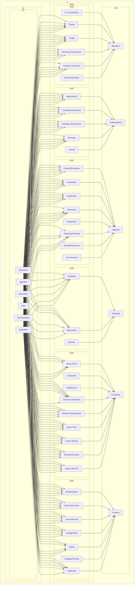

```mermaid
graph LR
subgraph A
 direction LR
 subgraph TAX
    direction TB
    CRT[Creating]
    EVL[Evaluating]
    ANL[Analysing]
    APL[Applying]
    UND[Understanding]
    RTN[Retention]
 end

subgraph GMS
 direction LR
 subgraph GM6
    GM61[Cut scenes/Story] --> RTN 
    GM62[Tokens] --> RTN 
    GM63[Virality] --> RTN 
    GM64[Behavioural Momentum] --> RTN 
    GM65[Pavlovian Interaction] --> RTN 
    GM66[Goods/Information] --> RTN 
 end
  subgraph GM5
    GM51[Appointment] --> UND 
    GM52[Cascading Information] --> UND 
    GM53[Quesitons and Answers] --> UND 
    GM54[Role-play] --> UND 
    GM55[Tutorial] --> UND 
 end
  subgraph GM4
    GM41[Capture/Elimination] --> APL 
    GM42[Competition] --> APL 
    GM43[Cooperation] --> APL 
    GM44[Movement] --> APL 
    GM45[Progression] --> APL 
    GM46[Selecting/Collecting] --> APL 
    GM47[Simulate/Response] --> APL 
    GM48[Time Pressure] --> APL 
 end   
 subgraph GM3
    GM31[Feedback] --> ANL 
    GM32[Meta-Game ] --> ANL
    GM33[Realism] --> ANL 
 end   
  subgraph GM2
    GM21[Action Points] --> EVL 
    GM22[Assesment] --> EVL
    GM23[Collaboration] --> EVL
    GM24[Communa lDiscovery] --> EVL
    GM25[Resource Management] --> EVL
    GM26[Game Turns] --> EVL 
    GM27[Pareto Optimal] --> EVL
    GM28[Rewards/Penalties] --> EVL
    GM29[Urgent Optmism] --> EVL
 end 
 subgraph GM1
    GM11[Design/Editing] --> CRT 
    GM12[Infinite Game Play] --> CRT 
    GM13[Ownership-GM] --> CRT 
    GM14[Protégé Effect] --> CRT 
    GM15[Status] --> CRT 
    GM16[Strategy/Planning] --> CRT 
    GM17[Tiles/Grids] --> CRT 
 end   
end

subgraph B
direction LR
subgraph PC  
direction LR
Abstraction[Abstraction] --> GM21
Abstraction[Abstraction] --> GM51
Abstraction[Abstraction] --> GM64
Abstraction[Abstraction] --> GM41
Abstraction[Abstraction] --> GM52
Abstraction[Abstraction] --> GM46
Abstraction[Abstraction] --> GM24
Abstraction[Abstraction] --> GM42
Abstraction[Abstraction] --> GM43
Abstraction[Abstraction] --> GM11
Abstraction[Abstraction] --> GM26
Abstraction[Abstraction] --> GM12
Abstraction[Abstraction] --> GM32
Abstraction[Abstraction] --> GM44
Abstraction[Abstraction] --> GM13
Abstraction[Abstraction] --> GM27
Abstraction[Abstraction] --> GM65
Abstraction[Abstraction] --> GM14
Abstraction[Abstraction] --> GM53
Abstraction[Abstraction] --> GM31
Abstraction[Abstraction] --> GM25
Abstraction[Abstraction] --> GM28
Abstraction[Abstraction] --> GM54
Abstraction[Abstraction] --> GM15
Abstraction[Abstraction] --> GM17
Abstraction[Abstraction] --> GM62
Abstraction[Abstraction] --> GM29
Abstraction[Abstraction] --> GM63
Algorithm[Algorithm] --> GM21
Algorithm[Algorithm] --> GM51
Algorithm[Algorithm] --> GM64
Algorithm[Algorithm] --> GM41
Algorithm[Algorithm] --> GM52
Algorithm[Algorithm] --> GM46
Algorithm[Algorithm] --> GM24
Algorithm[Algorithm] --> GM42
Algorithm[Algorithm] --> GM43
Algorithm[Algorithm] --> GM11
Algorithm[Algorithm] --> GM26
Algorithm[Algorithm] --> GM12
Algorithm[Algorithm] --> GM32
Algorithm[Algorithm] --> GM44
Algorithm[Algorithm] --> GM13
Algorithm[Algorithm] --> GM27
Algorithm[Algorithm] --> GM65
Algorithm[Algorithm] --> GM14
Algorithm[Algorithm] --> GM53
Algorithm[Algorithm] --> GM31
Algorithm[Algorithm] --> GM25
Algorithm[Algorithm] --> GM28
Algorithm[Algorithm] --> GM54
Algorithm[Algorithm] --> GM15
Algorithm[Algorithm] --> GM17
Algorithm[Algorithm] --> GM62
Algorithm[Algorithm] --> GM29
Algorithm[Algorithm] --> GM63
Automation[Automation] --> GM21
Automation[Automation] --> GM51
Automation[Automation] --> GM64
Automation[Automation] --> GM41
Automation[Automation] --> GM52
Automation[Automation] --> GM46
Automation[Automation] --> GM24
Automation[Automation] --> GM42
Automation[Automation] --> GM43
Automation[Automation] --> GM11
Automation[Automation] --> GM26
Automation[Automation] --> GM12
Automation[Automation] --> GM32
Automation[Automation] --> GM44
Automation[Automation] --> GM13
Automation[Automation] --> GM27
Automation[Automation] --> GM65
Automation[Automation] --> GM14
Automation[Automation] --> GM53
Automation[Automation] --> GM31
Automation[Automation] --> GM25
Automation[Automation] --> GM28
Automation[Automation] --> GM54
Automation[Automation] --> GM15
Automation[Automation] --> GM17
Automation[Automation] --> GM62
Automation[Automation] --> GM29
Automation[Automation] --> GM63
Data[Data] --> GM21
Data[Data] --> GM51
Data[Data] --> GM64
Data[Data] --> GM41
Data[Data] --> GM52
Data[Data] --> GM46
Data[Data] --> GM24
Data[Data] --> GM42
Data[Data] --> GM43
Data[Data] --> GM11
Data[Data] --> GM26
Data[Data] --> GM12
Data[Data] --> GM32
Data[Data] --> GM44
Data[Data] --> GM13
Data[Data] --> GM27
Data[Data] --> GM65
Data[Data] --> GM14
Data[Data] --> GM53
Data[Data] --> GM31
Data[Data] --> GM25
Data[Data] --> GM28
Data[Data] --> GM54
Data[Data] --> GM15
Data[Data] --> GM17
Data[Data] --> GM62
Data[Data] --> GM29
Data[Data] --> GM63
Decomposition[Decomposition] --> GM21
Decomposition[Decomposition] --> GM51
Decomposition[Decomposition] --> GM64
Decomposition[Decomposition] --> GM41
Decomposition[Decomposition] --> GM52
Decomposition[Decomposition] --> GM46
Decomposition[Decomposition] --> GM24
Decomposition[Decomposition] --> GM42
Decomposition[Decomposition] --> GM43
Decomposition[Decomposition] --> GM11
Decomposition[Decomposition] --> GM26
Decomposition[Decomposition] --> GM12
Decomposition[Decomposition] --> GM32
Decomposition[Decomposition] --> GM44
Decomposition[Decomposition] --> GM13
Decomposition[Decomposition] --> GM27
Decomposition[Decomposition] --> GM65
Decomposition[Decomposition] --> GM14
Decomposition[Decomposition] --> GM53
Decomposition[Decomposition] --> GM31
Decomposition[Decomposition] --> GM25
Decomposition[Decomposition] --> GM28
Decomposition[Decomposition] --> GM54
Decomposition[Decomposition] --> GM15
Decomposition[Decomposition] --> GM17
Decomposition[Decomposition] --> GM62
Decomposition[Decomposition] --> GM29
Decomposition[Decomposition] --> GM63
Evaluation[Evaluation] --> GM21
Evaluation[Evaluation] --> GM51
Evaluation[Evaluation] --> GM64
Evaluation[Evaluation] --> GM41
Evaluation[Evaluation] --> GM52
Evaluation[Evaluation] --> GM46
Evaluation[Evaluation] --> GM24
Evaluation[Evaluation] --> GM42
Evaluation[Evaluation] --> GM43
Evaluation[Evaluation] --> GM11
Evaluation[Evaluation] --> GM26
Evaluation[Evaluation] --> GM12
Evaluation[Evaluation] --> GM32
Evaluation[Evaluation] --> GM44
Evaluation[Evaluation] --> GM13
Evaluation[Evaluation] --> GM27
Evaluation[Evaluation] --> GM65
Evaluation[Evaluation] --> GM14
Evaluation[Evaluation] --> GM53
Evaluation[Evaluation] --> GM31
Evaluation[Evaluation] --> GM25
Evaluation[Evaluation] --> GM28
Evaluation[Evaluation] --> GM54
Evaluation[Evaluation] --> GM15
Evaluation[Evaluation] --> GM17
Evaluation[Evaluation] --> GM62
Evaluation[Evaluation] --> GM29
Evaluation[Evaluation] --> GM63

end
end
end
```